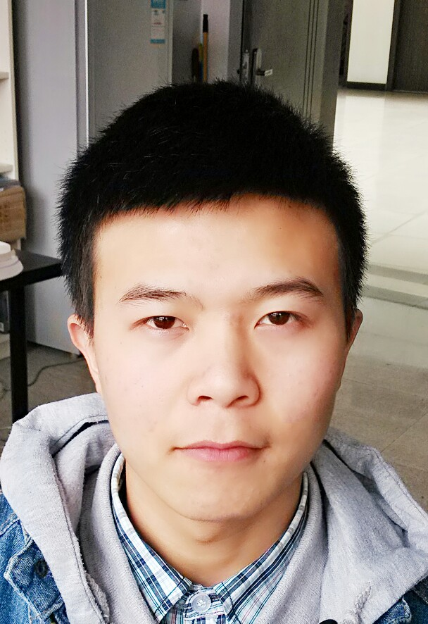

周伟强

Email:import.dream.js@gmail.com&nbsp;|&nbsp;
					Tel:18602850724&nbsp;|&nbsp; 
					Local:Chengdu 

方向:web前端开发&nbsp;||&nbsp;网页重构

项目经历

加入SysLab工作室(电子科大) | web前端开发 | 2012.09 ~ 至今

音乐站项目:为the one studio公司打造专属公司功能性网站,网站以国内动漫游戏等音乐录音为主旨,立志打造国内第一音乐录制网站.团队共五人开发,项目分三期完成,目前正在开发第一期,团队中担任front-end角色.

MTBook项目:主打国内第一全面山友资料的功能性门户网站,团队开发过程中, 担任前端leader,并为整个团队的良好沟通提供不可或缺的主力,且团队中担任front-end角色.

其他:在密切关注web开发之余,自学后端Python语言,并使用python写过功能完整的爬虫工具.使用过angularJS以及seajs,html5&css3等前端前沿技术搭建个人门户型网站.

注：SysLab工作室直属张翼成教授名下,专注web方向,孵化创业项目.是学院最早成立的工作室,也是至今最为规范的工作室.

掌握技能

HTML & XHTML & HTML5

4.5

CSS2 & CSS3

4.5

Javascript

4.0

JQuery

							
							
							
							
							4.5

PHP & Python

							
							
							2.0

C & C++

							2.0

教育背景

本科在读&nbsp;|&nbsp; web前端技术学习&nbsp;|&nbsp; 2011.09 ~ 至今

电子科技大学 (985高校 @ 成都)

本科专业:信息工程 (信息与软件工程学院)

全国大学生信息安全竞赛:全国三等奖

英语等级:四级

高中&nbsp;|&nbsp; 对互联网好奇,并开始接触互联网&nbsp;|&nbsp; 2008.09 ~ 2011.06
抚州市资溪县第一中学

总结

在大二上学期(2012.09)加入工作室以来,一直努力学习webd端开发技术,在此期间不仅掌握知识技术,更遇上很多志同道合的朋友.

就个人爱好而言,平时喜欢关注知乎上国内牛人(如玉伯,司徒正美等)的最新技术,喜欢关注web最新前沿技术,还要做一段时间的github新人.

关于web开发,已将其认真内化为一种习惯，期待将爱好（web）变成生活！！

&nbsp;&nbsp;&nbsp;&nbsp;&nbsp;&nbsp;&nbsp;&nbsp;&nbsp;&nbsp;&nbsp;&nbsp;&nbsp;&nbsp;&nbsp;&nbsp;一心向全端的前端程序员！！

&nbsp;&nbsp;&nbsp;&nbsp;&nbsp;&nbsp;&nbsp;&nbsp;&nbsp;&nbsp;&nbsp;&nbsp;&nbsp;&nbsp;&nbsp;&nbsp;&nbsp;&nbsp;&nbsp;&nbsp;&nbsp;&nbsp;&nbsp;&nbsp;&nbsp;&nbsp;&nbsp;&nbsp;&nbsp;&nbsp;&nbsp;&nbsp;&nbsp;&nbsp;&nbsp;&nbsp;&nbsp;&nbsp;&nbsp;&nbsp;&nbsp;开源万岁！！

